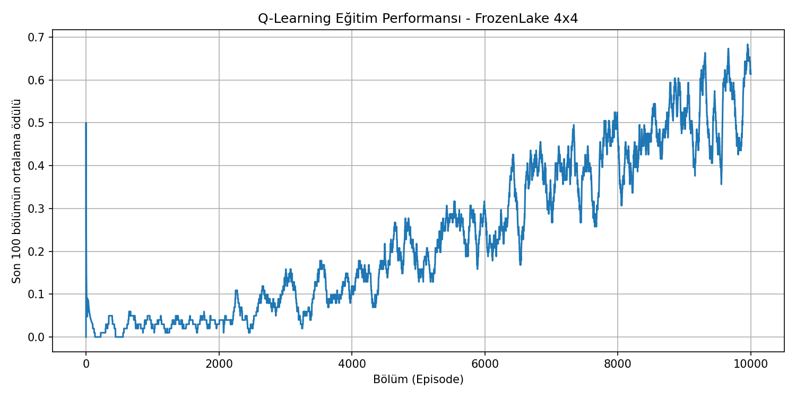

# ❄️ FrozenLake-QLearning

Klasik **FrozenLake-v1 (4x4, stokastik)** ortamında, tablo tabanlı
**Q-Learning** algoritmasıyla eğitilmiş bir ajan; buzlu, kaygan bir
gölün üzerinde delik (H) hücrelerine düşmeden hedefe (G) ulaşmayı
öğreniyor.

## 🎯 Proje Hakkında

Bu proje, Pekiştirmeli Öğrenme dersi kapsamında geliştirilmiştir.
**Q-Learning**, model-free ve off-policy bir algoritmadır; her
(durum, aksiyon) çifti için bir "kalite değeri" (Q-değeri) öğrenir
ve bu değerler doğrultusunda optimal politikaya yakınsar.

### Ortam Detayları

| Özellik | Açıklama |
|---|---|
| Ortam | FrozenLake-v1 (4x4) |
| Durum uzayı | 16 ayrık durum |
| Aksiyon uzayı | Discrete(4) → Sol / Aşağı / Sağ / Yukarı |
| Stokastiklik | `is_slippery=True` (buz kaygan, aksiyonlar %33 olasılıkla yan yöne kayabilir) |
| Ödül | Hedefe ulaşma: +1, diğer durumlar: 0 |

```
S F F F
F H F H
F F F H
H F F G
```

## 🧠 Algoritma: Q-Learning

Güncelleme kuralı:

```
Q(s, a) <- Q(s, a) + alpha * [ r + gamma * max(Q(s', a')) - Q(s, a) ]
```

Ajan, eğitim sırasında **epsilon-greedy** stratejisi kullanır:
başlangıçta tamamen rastgele hareket ederek ortamı keşfeder,
zamanla epsilon azaltılarak öğrendiği bilgiyi sömürmeye başlar.

| Hiperparametre | Değer |
|---|---|
| Öğrenme oranı (alpha) | 0.8 |
| İndirim faktörü (gamma) | 0.95 |
| Başlangıç epsilon | 1.0 |
| Epsilon azalma katsayısı | 0.9995 |
| Minimum epsilon | 0.01 |
| Eğitim bölüm sayısı | 10.000 |
| Test bölüm sayısı | 1.000 |

## 📈 Sonuçlar

Eğitim sürecinde son 100 bölümün ortalama ödülünün değişimi
aşağıdaki grafikte gösterilmiştir. Eğitim sonunda ajan, tamamen
öğrenilen politika ile test edilmiş ve **~%70-75 başarı oranı**
elde edilmiştir (slippery FrozenLake'te random politika ~%1-2
başarı verir).



## 📊 Veri Seti

Öğrenilen **Q-tablosu** (`q_table.csv`), 16 durum x 4 aksiyon
boyutunda küçük bir veri setidir ve ajanın her durumda hangi
aksiyonu ne kadar "değerli" bulduğunu gösterir.

## 🚀 Kurulum ve Çalıştırma

```bash
git clone https://github.com/Seyhmusonder/FrozenLake-QLearning.git
cd FrozenLake-QLearning

pip install gymnasium matplotlib numpy

python qlearning_frozenlake.py
```

Çalıştırma sonunda şu dosyalar üretilir:

- `training_rewards.png` — eğitim ödül grafiği
- `q_table.csv` — öğrenilen Q-tablosu

## 📁 Dosya Yapısı

```
FrozenLake-QLearning/
├── qlearning_frozenlake.py   # Q-Learning eğitim scripti
├── q_table.csv                # Öğrenilen Q-tablosu (veri seti)
└── training_rewards.png       # Eğitim ödül grafiği
```

## 🛠️ Kullanılan Teknolojiler

- Python 3.11
- [Gymnasium](https://gymnasium.farama.org/)
- NumPy, Matplotlib

## 🔮 Gelecek Geliştirmeler

- SARSA ile karşılaştırmalı performans analizi
- Deep Q-Network (DQN) ile büyük durum uzaylarına ölçekleme
- 8x8 FrozenLake haritasında deneme

---

*Bu proje, Pekiştirmeli Öğrenme dersi ödevi kapsamında geliştirilmiştir.*
